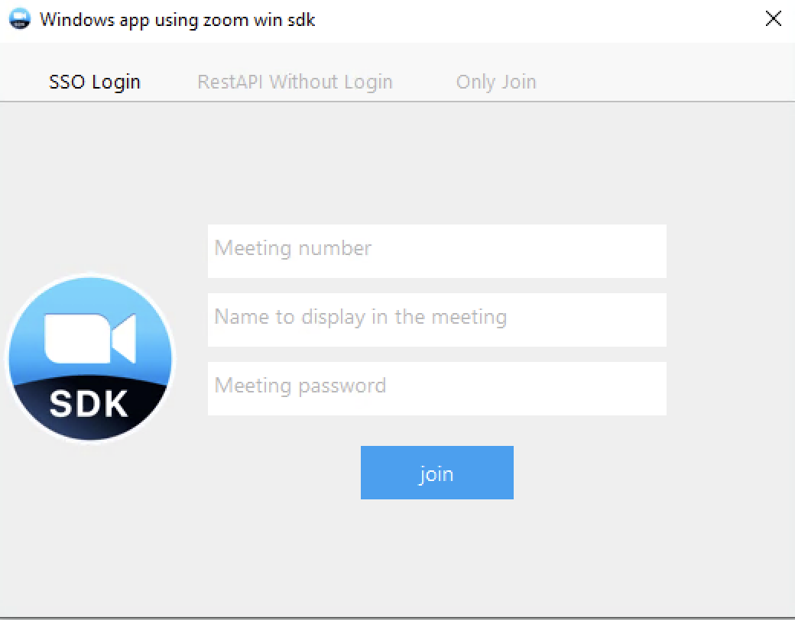

# Zoom Meeting virtual participant application

## About

This is a subproject of the AWS virtual participant framework for Zoom Meeting. It contains the artifacts needed to build virtual participant Windows applications using the Zoom Meeting Windows SDK which can be downloaded from the [Zoom App Marketplace](https://marketplace.zoom.us/docs/sdk/native-sdks/windows/).

The simplest way to run the virtual participant framework in your AWS account is using infrastructure as code project in the parent folder. However, if you wish to edit, build and test the Zoom Meeting sdk application locally or on a remote windows machine you can follow the instructions in this sub-project.

## Important

- As an AWS best practice, grant this code least privilege, or only the
  permissions required to perform a task. For more information, see
  [Grant least privilege](https://docs.aws.amazon.com/IAM/latest/UserGuide/best-practices.html#grant-least-privilege)
  in the *AWS Identity and Access Management User Guide*.
- This code has not been tested in all AWS Regions. Some AWS services are
  available only in specific AWS Regions. For more information, see the
  [AWS Regional Services List](https://aws.amazon.com/about-aws/global-infrastructure/regional-product-services/)
  on the AWS website.
- Running this code might result in charges to your AWS account.

## Prerequisites

> NOTE: This prototype was built/tested on Windows 10 64-bit Professional edition. Other versions of Windows may or may not be compatible with this project.

* Windows 10 64-bit operating system (or similar)
* Visual Studio Community (, Professional or Enterprise) 2019 (or 2022); please "ensure that you install Desktop development with C++ option from Workloads and the platform SDKs that you are building for" as described in [Zoom Meeting Windows SDK Getting Started - Prerequisites](https://marketplace.zoom.us/docs/sdk/native-sdks/windows/getting-started/prerequisites/), including the option for **Windows 10 SDK (10.0.18362.0)**
* [Python3 for Windows 64-bit](https://www.python.org/downloads/windows/)
* Git

## Getting Started

Before building the project the right resources and credentials must be created in [AWS](console.aws.amazon.com/) and on [Zoom App Marketplace](https://marketplace.zoom.us/docs/sdk/native-sdks/windows/)

### Provision cloud resources

To test full functionality of streaming multimedia from a Zoom Meeting to AWS, the following cloud resources must be provisioned. These steps must be taken prior to building this project locally or for custom CI/CD

1. Choose an AWS account and select a region that support Amazon Kinesis Video Stream (KVS)
2. Create an Amazon SNS topic with the right rousource policy and subscription
3. Create an IAM User whose credential will be used by the Zoom Meeting Windows SDK application to connect to AWS
4. Create an IAM Policy for the IAM User allowing it to publish to SNS and act as an Amazon KVS producer

> Note: Please refer to [Amazon SNS](https://docs.aws.amazon.com/sns/latest/dg/sns-security.html) and [Amazon KVS](https://docs.aws.amazon.com/kinesisvideostreams/latest/dg/security.html) documentations on Security for best practices 

### Get developer keys from the Zoom App Marketplace

The virtual participant runs as a Windows app built ontop of Zoom Meeting Windows SDK. For connectivity to Zoom Service and to download the SDK:

1. Login to [Zoom App Marketplace](https://marketplace.zoom.us/) (Use your Zoom login - free accounts work!)
2. From the "Develop" drop-down choose "Build App"
3. From the options available "Create" a "Meeting SDK" app type and follow the instructions
4. In the resulting screen, click on "App Credential" from the sidebar to make note of "SDK Key" and "SDK Secret"

> Note: Later you will need to download the Windows SDK from this screen using the "Download" option on the sidebar.

### Apply Zoom SDK patch
If you haven't completed this step from the parent directory instructions

1. Download `zoom-sdk-windows-5.12.8.10282.zip` from the [Zoom App Marketplace](https://marketplace.zoom.us/docs/sdk/native-sdks/windows/)
2. Unzip the code archive to the this directory, so there is a **zoom-sdk-windows-5.12.8.10282** directory here.
3. Verify that you can successfully run 

	```
	dir zoom-sdk-windows-5.12.8.10282
	```
4. Apply the Zoom Windows SDK patch:

    ```
    git apply -p1 --directory zoom-sdk-windows-5.12.8.10282 --verbose --reject --whitespace=fix zoom_sdk_demo_v2.patch
    ``` 


## Building the Zoom Meeting Windows SDK Application Locally

The following instructions will:

* Install GStreamer (required for building KVS Producer SDK)
* Install StrawberryPerl and Netwide Assembler (NASM) (required for building Amazon KVS Producer SDK)
* Clone, patch, and build the [Amazon Kinesis Video Streams Producer SDK for C++](https://github.com/awslabs/amazon-kinesis-video-streams-producer-sdk-cpp)
* Installing additional dependencies with [vcpkg package manager for C/C++](https://vcpkg.io/en/index.html)
* build and run the 

### Install GStreamer for Windows (v1.20.3)

Download and install the following *.msi installation packages. During installation, select **Complete** installation.

* [GStreamer 1.20.3 runtime installer - MSVC 64-bit (VS 2019, Release CRT)](https://gstreamer.freedesktop.org/data/pkg/windows/1.20.3/msvc/gstreamer-1.0-msvc-x86_64-1.20.3.msi)
* [GStreamer 1.20.3 development installer - MSVC 64-bit (VS 2019, Release CRT)](https://gstreamer.freedesktop.org/data/pkg/windows/1.20.3/msvc/gstreamer-1.0-devel-msvc-x86_64-1.20.3.msi)

### Install StrawberryPerl and Netwide Assembler (NASM) for Windows

Perform the following tasks:

1. [Install Chocolately package manager for Windows)](https://chocolatey.org/install)

2. Install NASM and Strawverryperl (and Git if not accessible via command prompt)

	```
	choco install nasm strawberryperl git -y
	```
3. To enable Git to use pathnames longer than 260 characters, run 

	```
	git config --system core.longpaths true
	``` 

### Build the Amazon Kinesis Video Streams Producer SDK for C++

Perform the following tasks in windows command prompt (make sure you have Git installed first!):

1. Run the following commands

	```
	cd C:
	git clone https://github.com/awslabs/amazon-kinesis-video-streams-producer-sdk-cpp.git
	```
3. Copy `kvs_msvc.patch` and `build_kvs_windows.bat` files from this repo to `C:\amazon-kinesis-video-streams-producer-sdk-cpp`
4. Run the following commands

	```
	cd C:\amazon-kinesis-video-streams-producer-sdk-cpp
	git apply kvs_msvc.patch
	call build_kvs_windows.bat
	setx GST_PLUGIN_SYSTEM_PATH "%GST_PLUGIN_SYSTEM_PATH%;C:\amazon-kinesis-video-streams-producer-sdk-cpp\build"
	setx /M PATH "%PATH%;C:\amazon-kinesis-video-streams-producer-sdk-cpp\open-source\local\bin;C:\amazon-kinesis-video-streams-producer-sdk-cpp\open-source\local\lib"
	```

> NOTE: You may need to edit the first lines of `build_kvs_windows.bat` based on the version of Visual Studio Community (, Professional or Enterprise) 2019 (or 2022) you have installed.

### Install dependencies with vcpkg

1. Open a new command prompt window and run: 
	
	```
	cd C:
	```

	> Note: If you have vcpkg already installed, skip the following. If you do **NOT** already have vcpkg installed, run the following commands:
	> 
	```
	git clone https://github.com/Microsoft/vcpkg.git
	call .\vcpkg\bootstrap-vcpkg.bat
	```

2. Install the dependencies required for the prototype. Run the following commands:

	```
	vcpkg\vcpkg install "aws-sdk-cpp[sns]" --recurse --triplet x64-windows
	vcpkg\vcpkg install "crow" --triplet x64-windows
	vcpkg\vcpkg install "cpp-jwt" --triplet x64-windows
	vcpkg\vcpkg integrate install
	```

### Set environment variables

Set the following environment variables on the local windows machine:

```
AWS_ACCESS_KEY_ID=<IAM User Access Key>
AWS_SECRET_ACCESS_KEY=<IAM User Secret Key - do not expose>
KVS_STREAM_SUFFIX=<used to distinguish Amazon KVS streams for different meetings>
AWS_DEFAULT_REGION=<e.g. us-west-2>
SNS_TOPIC_ARN=<Taking the form of arn:aws:sns:<AWS_Region>:<AWS_Account_ID>:<Topic_Name>"
ZOOM_APP_KEY=<Zoom SDK KEY from Zoom App Marketplace>
ZOOM_APP_SECRET=<Zoom SDK SECRET from Zoom App Marketplace>
``` 

> :warning: These variables contain sensitive AWS and Zoom account information. Ensure they are not exposed inadvertently. 


### Build and run application with Visual Studio 

To test the functionality of the applicaiton perform the following tasks:

1. In Visual Studio open the solution in `zoom-sdk-windows-5.12.8.10282\x64\demo\sdk_demo_v2` directory
2. Choose **"Release"** and **"x64"** configuration and build solution. 
3. Launch application with debugger (shortcut: F5) and accept network access.
4. If Zoom app SDK credentials are ok you should see the following dialog:

	
5. Start a Zoom meeting as host with a native desktop/mobile client and take note of meeting id and passcode
    > Note: to avoid audio echo, it is best to run Zoom meeting as host on a different machine as the one running your application.  

6. Enter the following in the application dialog and press the **join** button
    * `meeting id` (from host meeting)
    * `diplay name` (virtual partipant name)
    * `meeting passcode` (from host meeting)

7. After the virtual participant has joined, allow the virtual participant to locally record the meeting from the Zoom Meeting host client machine. This will trigger the virtual participant application to stream multimedia (Mixed-audio for now) to Amazon Kinesis Video.


> Notes:
>  
> i. To read on the capabilities of the Zoom Meeting Winodws SDK please refer to the [docs on Zoom App Marketplace](https://marketplace.zoom.us/docs/sdk/native-sdks/windows/)
>
> ii. The audio streamed to Amazon KVS is PCM-uLaw format. This format is not supported for playback in the AWS console or using HLS/MPEG-DASH. However it can be used a supported format for transcription in Amazon Transcribe.


## Run Amazon Transcribe Tester NodeJS app 

To see live transcription of Zoom Meeting audio and verify transcription, run the tester app in the [transcribe_tester_app](./transcribe_tester_app/) folder.  See [transcribe_tester_app/README.md](./transcribe_tester_app/README.md) for details.


## Clean Up

From AWS console, delete all Amazon KVS streams and the SNS Topic. If you created an IAM User for testing purposes, either remove it entirely or remove the Amazon SNS and Amazon KVS policies associated with it.